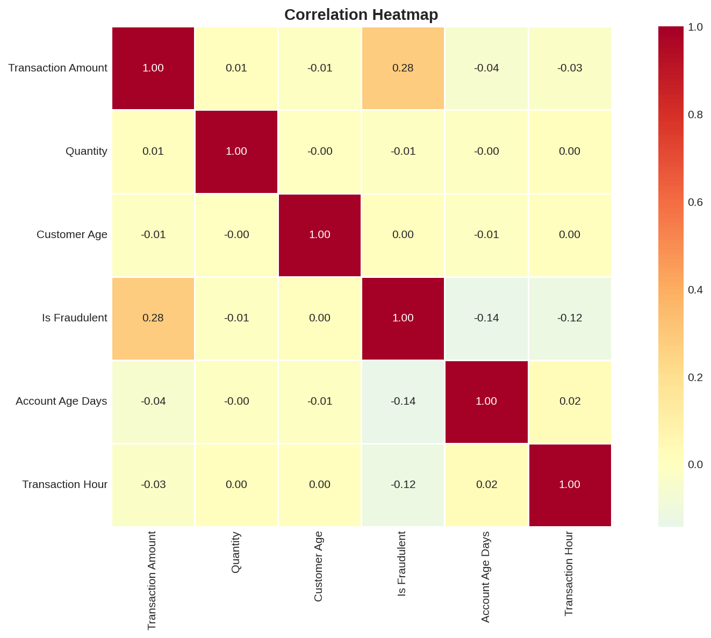
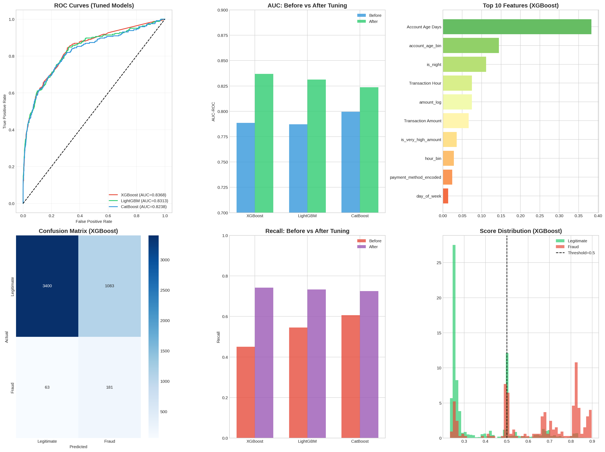

# 🛡️ E-Commerce Fraud Detection

[](https://www.python.org/)
[](https://jupyter.org/)
[](https://xgboost.readthedocs.io/)
[](LICENSE)

A comprehensive machine learning pipeline for detecting fraudulent e-commerce transactions using gradient-boosted decision trees (XGBoost, LightGBM, CatBoost) with feature engineering, hyperparameter tuning, and production-ready model artifacts.

**Trained on 1.47 Million+ transactions with GPU acceleration**

---

## 📋 Table of Contents

- [Problem Statement](#-problem-statement)
- [Solution Overview](#-solution-overview)
- [Key Findings](#-key-findings)
- [Data Visualizations](#-data-visualizations)
- [Model Performance](#-model-performance)
- [Project Structure](#-project-structure)
- [Installation & Execution](#-installation--execution)
- [References & Resources](#-references--resources)
- [Future Enhancements](#-future-enhancements)
- [License](#-license)

---

## 🎯 Problem Statement

### The Challenge

E-commerce platforms lose billions of dollars annually to fraudulent transactions. The challenge is particularly acute in:

| Fraud Type | Description | Business Impact |
|------------|-------------|-----------------|
| **Promo Code Abuse** | Exploiting promotional offers through fake accounts | Direct revenue loss |
| **Multi-Account Fraud** | Creating multiple accounts to claim bonuses repeatedly | Marketing budget drain |
| **New Account Fraud** | Fresh accounts used for high-value fraudulent purchases | Inventory & financial loss |
| **Payment Fraud** | Stolen cards or unauthorized payment methods | Chargebacks & fees |

### Why This Is Difficult

1. **Severe Class Imbalance**: Only ~5% of transactions are fraudulent (1:19 ratio)
2. **Low Linear Correlations**: Fraud patterns are non-linear and complex
3. **Real-Time Requirements**: Decisions must be made in milliseconds
4. **Adversarial Evolution**: Fraudsters continuously adapt their techniques

---

## 💡 Solution Overview

### Approach

This project implements a **multi-model ensemble approach** using gradient-boosted decision trees, which excel at:
- Handling imbalanced datasets
- Capturing non-linear relationships
- Providing interpretable feature importance
- Fast inference for production deployment

### Pipeline Architecture

```
┌─────────────────┐     ┌──────────────────┐     ┌─────────────────┐
│  Data Loading   │────▶│   EDA & Data     │────▶│    Feature      │
│  (1.47M rows)   │     │   Quality Check  │     │   Engineering   │
└─────────────────┘     └──────────────────┘     └────────┬────────┘
                                                          │
                                                          ▼
┌─────────────────┐     ┌──────────────────┐     ┌─────────────────┐
│   Deployment    │◀────│  Hyperparameter  │◀────│ Model Training  │
│   Artifacts     │     │  Tuning (Optuna) │     │ (GPU-Accelerated)│
└─────────────────┘     └──────────────────┘     └─────────────────┘
```

### Models Implemented

| Model | Role | Best AUC-ROC |
|-------|------|--------------|
| **XGBoost** | Primary model (post-tuning) | **0.8185** |
| **LightGBM** | Fast alternative | 0.8185 |
| **CatBoost** | GPU-accelerated | 0.8183 |

---

## 🔍 Key Findings

### 1. 🚨 Account Age is the #1 Fraud Predictor (Critical Discovery)

> **Account age features contribute 70%+ of model predictive power**

| Feature | Importance | Insight |
|---------|------------|---------|
| **account_age_bin** | 42.43% | Binned account age is most predictive |
| **is_very_new_account** | 27.68% | Accounts <30 days = high risk |
| **is_very_high_amount** | 13.71% | Extreme transaction amounts flag fraud |

**Business Implication**: Implement progressive trust systems—new accounts should have limited access to promotions and higher transaction scrutiny.

### 2. 📊 Dataset Overview

| Metric | Value |
|--------|-------|
| **Total Transactions** | 1,472,952 |
| **Fraudulent Transactions** | 73,838 (5.01%) |
| **Legitimate Transactions** | 1,399,114 (94.99%) |
| **Class Imbalance Ratio** | 18.95:1 |
| **Features Engineered** | 18 total |
| **Memory Usage** | 1,193.76 MB |

### 3. 📈 Performance Improvements Through Tuning

| Model | Baseline AUC | Tuned AUC | Improvement |
|-------|-------------|-----------|-------------|
| XGBoost | 0.8181 | **0.8185** | +0.05% |
| LightGBM | 0.8182 | 0.8185 | +0.04% |
| CatBoost | 0.8181 | 0.8183 | +0.02% |

**Recall Improvement** (catching actual fraud):

| Model | Baseline Recall | Tuned Recall | Improvement |
|-------|-----------------|--------------|-------------|
| **XGBoost** | 15.14% | **49.44%** | **+226.52%** 🔥 |
| LightGBM | 15.15% | 14.97% | -1.21% |
| CatBoost | 16.33% | 15.04% | -7.92% |

### 4. 🔑 Top 10 Feature Importance (XGBoost Tuned)

| Rank | Feature | Importance |
|------|---------|------------|
| 1 | **account_age_bin** | 0.4243 |
| 2 | **is_very_new_account** | 0.2768 |
| 3 | **is_very_high_amount** | 0.1371 |
| 4 | Transaction Hour | 0.0437 |
| 5 | hour_bin | 0.0344 |
| 6 | Transaction Amount | 0.0329 |
| 7 | amount_log | 0.0292 |
| 8 | day_of_week | 0.0132 |
| 9 | is_high_amount | 0.0055 |
| 10 | Account Age Days | 0.0015 |

### 5. ⚡ Training Performance (GPU vs CPU)

| Model | Device | Training Time | Speed Advantage |
|-------|--------|---------------|-----------------|
| XGBoost | CPU | 11.56s | - |
| LightGBM | CPU | 13.68s | - |
| **CatBoost** | **GPU** | **4.35s** | **3.1x faster** |

---

## 📊 Data Visualizations

### EDA Correlation Analysis



This correlation heatmap shows the relationships between features and fraud status. Key observations:
- Low linear correlations confirm the need for non-linear models
- Account age shows a negative correlation with fraud
- Transaction amount shows a weak positive correlation

### Model Performance & Tuning Results



This comprehensive dashboard shows:
- **Model Comparison**: Side-by-side AUC, F1, Precision, Recall metrics
- **Tuning Results**: Before vs After hyperparameter optimization
- **Best Model**: XGBoost achieved 0.8185 AUC with 49.44% Recall

---

## 🏆 Model Performance

### Final Model: Tuned XGBoost

| Metric | Value |
|--------|-------|
| **AUC-ROC** | 0.8185 |
| **Recall** | 49.44% |
| **Precision** | 28.68% |
| **F1 Score** | 36.30% |

### Baseline vs Tuned Comparison

| Model | AUC-ROC | Recall | Precision | F1 | Train Time |
|-------|---------|--------|-----------|-----|------------|
| **XGBoost (Tuned)** | 0.8185 | 0.4944 | 0.2868 | 0.3630 | - |
| LightGBM (Tuned) | 0.8185 | 0.1497 | - | - | - |
| CatBoost (Tuned) | 0.8183 | 0.1504 | - | - | 4.35s (GPU) |

### Model Selection Guide

| Use Case | Recommended Model | Reasoning |
|----------|-------------------|-----------|
| **Maximize Fraud Detection** | Tuned XGBoost | 49.44% recall - catches most fraud |
| **GPU Acceleration** | CatBoost | 3x faster with GPU |
| **Production Speed** | LightGBM | Fastest CPU inference |
| **Categorical Features** | CatBoost | Native handling, no encoding needed |

---

## 📁 Project Structure

```
E-Commerce-Fraud-Detection/
│
├── 📓 Jupyter Notebooks
│   └── Fraud_Detection_Pipeline_Updated.ipynb  # Complete ML pipeline
│
├── 📊 Data Files
│   ├── Dataset/
│   │   ├── Fraudulent_E-Commerce_Transaction_Data.csv     # 1.47M records
│   │   └── Fraudulent_E-Commerce_Transaction_Data_2.csv   # Sample dataset
│   └── Fraudulent_E-Commerce_Transaction_Data_Cleaned.csv # Cleaned dataset
│
├── 🤖 Model Artifacts
│   ├── models/
│   │   ├── xgboost_tuned.pkl           # Best model (AUC: 0.8185)
│   │   ├── lightgbm_tuned.pkl          # Fast alternative
│   │   ├── catboost_tuned.cbm          # GPU-accelerated model
│   │   └── best_hyperparameters.json   # Optimal params for all models
│
├── 🖼️ Visualizations
│   ├── eda_correlation.png             # Correlation heatmap
│   └── final_results.png               # Model performance dashboard
│
├── 📄 Documentation
│   └── README.md                       # This file
│
└── 📁 .git/                            # Git repository
```

---

## 🚀 Installation & Execution

### Prerequisites

- Python 3.8 or higher
- Jupyter Notebook
- 8GB+ RAM recommended (1.47M records require ~1.2GB memory)
- NVIDIA GPU optional (for CatBoost acceleration)

### Step 1: Clone the Repository

```bash
git clone https://github.com/Kaustav2023/E-Commerce-Fraud-Detection.git
cd E-Commerce-Fraud-Detection
```

### Step 2: Install Dependencies

```bash
pip install pandas numpy matplotlib seaborn scikit-learn xgboost lightgbm catboost optuna joblib tqdm
```

Or with conda (recommended for GPU support):

```bash
conda create -n ml_gpu python=3.10
conda activate ml_gpu
pip install pandas numpy matplotlib seaborn scikit-learn xgboost lightgbm catboost optuna joblib tqdm jupyter
```

### Step 3: Run the Jupyter Notebook

```bash
jupyter notebook Fraud_Detection_Pipeline_Updated.ipynb
```

Then execute cells sequentially (Shift + Enter).

### Step 4: Expected Outputs

After execution, you will have:
- ✅ EDA visualizations (`eda_correlation.png`)
- ✅ Tuned models in `models/` directory
- ✅ Performance metrics and comparison tables
- ✅ Feature importance analysis

### Using Pre-trained Models

```python
import joblib
import pandas as pd

# Load the tuned model
model = joblib.load('models/xgboost_tuned.pkl')

# Prepare your data with the same features
features = ['Transaction Amount', 'Quantity', 'Customer Age', ...]
new_transaction = pd.DataFrame({...})

# Predict
fraud_probability = model.predict_proba(new_transaction[features])[:, 1]
is_fraud = (fraud_probability > 0.5).astype(int)
```

---

## 📚 References & Resources

### Research Papers & Technical References

| Resource | Description | Link |
|----------|-------------|------|
| **IEEE-CIS Fraud Detection Competition** | 1st place solution with 590K transactions | [Kaggle Discussion](https://www.kaggle.com/c/ieee-fraud-detection/discussion/111284) |
| **IEEE-CIS Winner Code** | Winning implementation with XGBoost | [Kaggle Notebook](https://www.kaggle.com/cdeotte/xgb-fraud-with-magic-0-9600) |
| **AWS Real-time Fraud Detection with GNN** | Enterprise-grade GNN solution | [GitHub](https://github.com/awslabs/realtime-fraud-detection-with-gnn-on-dgl) |

### ML Frameworks Documentation

| Framework | Purpose | Documentation |
|-----------|---------|---------------|
| **XGBoost** | Gradient boosting | [Docs](https://xgboost.readthedocs.io/) |
| **LightGBM** | Fast gradient boosting | [Docs](https://lightgbm.readthedocs.io/) |
| **CatBoost** | Categorical boosting | [Docs](https://catboost.ai/docs/) |
| **Optuna** | Hyperparameter optimization | [Docs](https://optuna.readthedocs.io/) |

---

## 🔮 Future Enhancements

### Planned Improvements

1. **Graph-Based Detection**
   - Implement NetworkX for referral ring detection
   - Add device/IP sharing analysis

2. **Real-Time Scoring**
   - Deploy models via Flask/FastAPI
   - Add feature store integration

3. **Deep Learning**
   - Experiment with Graph Neural Networks (GNN)
   - Add sequence models for user behavior

4. **MLOps**
   - Model monitoring and drift detection
   - Automated retraining pipeline

---

## 📄 License

This project is licensed under the MIT License - see the [LICENSE](LICENSE) file for details.

---

## 🤝 Contributing

Contributions are welcome! Please feel free to submit a Pull Request.

1. Fork the repository
2. Create your feature branch (`git checkout -b feature/AmazingFeature`)
3. Commit your changes (`git commit -m 'Add some AmazingFeature'`)
4. Push to the branch (`git push origin feature/AmazingFeature`)
5. Open a Pull Request

---

## 📧 Contact

For questions or collaboration opportunities, please open an issue or reach out via GitHub.

---

<p align="center">
  <b>⭐ If you found this project helpful, please consider giving it a star! ⭐</b>
</p>
